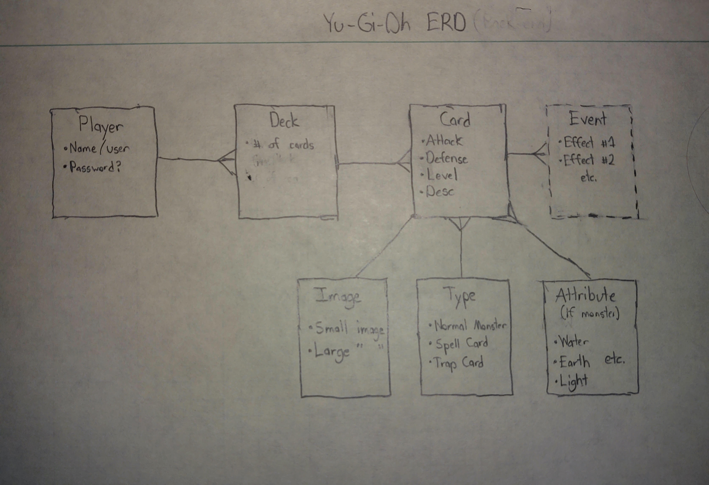

# Deere Project 4 - Back End

## Description
This app is meant to simulate the Yu-Gi-Oh! Trading Card Game, a card-based battle game that is basically just glorified math. It is a simplified version, with normal, non-effect monsters and minimal spell/trap cards to make project completion possible. More of the game's logic (ex. effect monsters) will be added as a gold plan.

## User Stories
- To be able to create new decks
- To be able to name those decks for clarity's sake
- In navigating those decks, be able to add cards
- Similarly, be able to delete cards from said deck

## The Plan
- ERD:

## The Approach

## Technologies Used
Javascript ES6   
REST, CRUD  
Sequelize Associations  
Cloud-based Hosting (Heroku)  
Bootstrap

## Unsolved issues/Future Improvements
- Use verifyToken the eliminated the need for a userID input
   - Originally, verifyToken middleware was used to provide req.user login info
   - This eliminated the need for a param input for the user ID
   - However, React does not play well with Express without ceratin authentication
      - Throws 401 (Unauthorized) network status
   - Though this could have been patched, the technicality behind this was too lengthy for this project timeline
- As a result of the first bullet, the Sequelize assocations are not the most efficient

